# Autotuning PostgreSQL: Pipeline

> **Status: projeto interrompido, arquivado (resultados finais fechados em
> 2026-05-30).** Concebi este projeto para ser o tema do meu TCC, mas não
> cheguei a usá-lo de fato como TCC: faltou concluir a etapa de validação
> das recomendações em instâncias de nuvem real (os 3 tiers avaliados aqui
> são containers Docker rodando na mesma máquina física, não nuvem de
> verdade, ver [Limitações](#limitações)), etapa que esbarrou numa barreira
> financeira de custo de infraestrutura. Migrei para um novo tema de
> TCC (pré-aquecimento preditivo de infraestrutura de dado serverless em
> pipelines de treino de ML). Este repositório e seus 2 irmãos ficam mantidos
> como referência funcional e ponto de partida de ideias (ver seção
> "Investigação final" abaixo).

## Sumário

- [Objetivo do projeto](#objetivo-do-projeto)
- [Participantes](#participantes)
- [Tecnologias](#tecnologias)
- [Arquitetura: como funciona de ponta a ponta](#arquitetura-como-funciona-de-ponta-a-ponta)
- [Ciclo de vida de uma tarefa, em detalhe](#ciclo-de-vida-de-uma-tarefa-em-detalhe)
- [Pipeline de ML em detalhe](#pipeline-de-ml-em-detalhe)
- [Resultados e análise](#resultados-e-análise)
- [Limitações](#limitações)
- [Estrutura do Projeto](#estrutura-do-projeto)
- [Requisitos](#requisitos)
- [Como Executar](#como-executar)
- [Investigação final: sementes pro próximo TCC](#investigação-final-2026-08-09-sementes-pro-próximo-tcc)
- [Escopo deste repositório](#escopo-deste-repositório)

## Objetivo do projeto

Meta-modelagem para recomendação de configurações custo-efetivas do
PostgreSQL em workloads analíticos (OLAP). Problema real: achar uma boa
combinação de parâmetros de tuning do Postgres para um hardware/carga
específicos exige rodar benchmarks de verdade: caro e lento, sobretudo em
nuvem. A proposta: treinar um meta-modelo (ML) que aprenda, a partir de
execuções reais passadas, a **prever o desempenho de uma configuração nova
sem precisar rodá-la**, usando essa previsão para recomendar a melhor
configuração dentre um conjunto de candidatas.

**Método**: Latin Hypercube Sampling sobre 33 parâmetros do PostgreSQL (3
"stages": memória/paralelismo básico, custos de planejamento de join,
toggles avançados do planner), combinados em 7 formas e testados em 3 tiers
de hardware (low/medium/high), cada configuração executada de verdade num
container Docker isolado rodando as suítes completas **TPC-H** (20 queries)
e **TPC-DS** (98 queries). Sobre esses dados reais, treina 4 especialistas
XGBoost (tempo TPC-H, tempo TPC-DS, cache hit, spill em disco) combinados
num score composto ponderado usado pelo `ml/recommend.py` para ranquear
configurações candidatas.

Este repositório é o motor de tudo isso: coleta de benchmark e pipeline de
ML. Contém:

- `sampler/`: amostragem de espaços de configuração (LHS) do PostgreSQL
- `taskqueue/`: fila de tarefas de benchmark (Postgres, `SELECT ... FOR UPDATE SKIP LOCKED`)
- `runner/`: execução dos benchmarks (Docker + PostgreSQL)
- `benchmarks/`: definições, queries e build de imagem do TPC-H e TPC-DS
- `monitoring/`: coleta de métricas de hardware durante a execução
- `utils/`: utilitários compartilhados
- `cli/`: scripts de linha de comando (`generate.py`, `prepare.py`, `run.py`)
- `ml/`: extração de features e pipeline de treinamento/avaliação/tuning
  (XGBoost `XGBRegressor` + `XGBRanker`, Optuna, SHAP)
- `specs/`: especificações (JSON) dos espaços de configuração e dos recursos Docker por tier
- `docs/`: documentação (MkDocs) de arquitetura, decisões de engenharia e
  resultados
- `data/processed/features.csv`: dataset de features já extraído, versionado
- `data/raw/rodada{1,2}/`: resultados de benchmark reais já coletados e
  "enxutos" (só os campos que `ml/extract_features.py` de fato lê, ~5,5MB
  no total vs. 2,2GB dos JSONs originais), versionados de propósito para
  reproduzir a extração de features e o treinamento sem precisar rodar
  nenhum benchmark novamente (`make features && make train`)

## Participantes

| Nome | Matricula |
|---|---|
| Gustavo Vieira de Araujo | 211068440 |

## Tecnologias

| Tecnologia | Uso |
|---|---|
| Python 3.12 | Linguagem principal do pacote (`sampler`, `taskqueue`, `runner`, `monitoring`, `ml`, `cli`) |
| psycopg | Cliente PostgreSQL usado pela fila de tarefas e pela persistência de resultados |
| docker (SDK Python) | Sobe e derruba os containers efêmeros de benchmark |
| psutil | Coleta de métricas de hardware (CPU, memória, disco) |
| pandas, numpy, scipy | Manipulação de dados e cálculo de features |
| scikit-learn | `KFold` e métricas auxiliares de avaliação |
| XGBoost (`XGBRegressor` + `XGBRanker`) | Treino dos 4 especialistas e do ranker |
| Optuna | Tuning de hiperparâmetros dos modelos |
| SHAP | Análise de importância de features |
| MkDocs + mkdocs-material | Documentação técnica versionada em `docs/` |
| Docker | Isolamento dos benchmarks TPC-H/TPC-DS em containers efêmeros |
| PostgreSQL 17 | Banco de controle da fila e banco benchmarcado dentro dos containers |
| ruff | Lint e ordenação de imports |

## Arquitetura: como funciona de ponta a ponta

O pipeline é dividido em dois grandes momentos: **coleta** (gerar
configurações, executá-las de verdade em containers Docker e persistir os
resultados) e **aprendizado** (transformar esses resultados em features,
treinar os especialistas e usá-los para ranquear configurações novas). O
elo entre os dois é sempre um banco Postgres de controle (não um arquivo
local), o que permite múltiplos workers `cli/run.py`, inclusive em máquinas
diferentes, disputando a mesma fila com segurança.



**Como ler o diagrama**: a metade de cima roda em loop, tarefa após tarefa,
até a fila esvaziar: é a parte cara (pode levar dias). A metade de baixo
roda em segundos a partir do CSV já extraído, e é por isso que
`data/processed/features.csv` e os `data/raw/rodada{1,2}/` enxutos ficam
versionados no repositório: qualquer pessoa reproduz o treino e a avaliação
sem rodar um único benchmark.

## Ciclo de vida de uma tarefa, em detalhe

Para entender o pipeline de coleta é mais fácil seguir uma única
configuração da amostragem até virar uma linha do `features.csv`.

**1. Amostragem (`sampler/`).** `cli/generate.py` gera, para cada uma das 7
combinações de stages (`s1`, `s2`, `s3`, `s1_s2`, `s1_s3`, `s2_s3`,
`s1_s2_s3`) e cada um dos 3 tiers de hardware, um conjunto de configurações
via Latin Hypercube Sampling sobre os parâmetros ativos naquela combinação
(`sampler/space_loader.py` lê os intervalos de `specs/spaces/stage{1,2,3}/{tier}.json`,
por exemplo: no stage 1 do tier `low`, `shared_buffers` só pode assumir
`256MB`, `384MB` ou `512MB`, e `jit` é fixado em `0` porque com 2 vCPUs o
overhead de compilação supera o ganho). O padrão de `cli/generate.py` é 51
configs por combinação (`_DEFAULT_N_CONFIGS = 51`, múltiplo de 3 para
distribuir igualmente entre os tiers).

**2. Enfileiramento (`taskqueue/`).** Cada configuração amostrada vira uma
linha `INSERT INTO tasks (combination, tier, config, repetition)` com
`status = 'pending'` (`ExecutionQueue.from_dict`, chamado a partir de
`all_results`, o dict `{combinação: {tier: [configs]}}` retornado pelo
sampler). O schema de `tasks` (`db/schema.sql`) guarda a config inteira
como `JSONB`, o `retry_count`, o `abandoned_reason` e um lease
(`claimed_at`, `claimed_by`) usado para detectar workers mortos.

**3. Reivindicação segura por um worker (`ExecutionQueue.next()`).** Um
worker `cli/run.py` chama `queue.next()`, que executa:

```sql
UPDATE tasks
SET status = 'running', claimed_at = now(), claimed_by = %(worker_id)s
WHERE id = (
    SELECT id FROM tasks
    WHERE status = 'pending'
       OR (status = 'running' AND claimed_at < now() - <lease do tier>)
    ORDER BY (status = 'running'), id
    FOR UPDATE SKIP LOCKED
    LIMIT 1
)
RETURNING ...
```

`FOR UPDATE SKIP LOCKED` garante que, com múltiplos workers concorrentes,
cada um pega uma linha diferente sem bloquear os outros. Nenhum
coordenador central é necessário. O `WHERE` também reivindica tarefas que
ficaram travadas em `running` além do lease do seu tier (3,5h para `low`,
4,5h para `medium`, 8,5h para `high`, uma margem sobre o timeout real de
execução de `runner/task_executor.py`, que é 3h/4h/8h). Isso resolve
recuperação de crash sem heartbeat: se um worker morre no meio de uma
tarefa, ela volta sozinha para a fila depois do lease expirar.

**4. Execução em container Docker efêmero (`runner/` + `benchmarks/`).**
`runner/task_executor.py::run_task()` sobe **um container por benchmark**
(um para TPC-H, outro para TPC-DS, sequencialmente), usando
`benchmarks/container.py::start_postgres_container()`. O container usa uma
das 6 imagens pré-construídas por `benchmarks/image_builder.py` (uma por
combinação benchmark×tier: `tpch-postgres:sf{1,2,4}` e
`tpcds-postgres:sf{1,2,4}`), que já têm os dados do TPC-H/TPC-DS
carregados via `dbgen`/`dsdgen` e commitados no `PGDATA`, então subir um
container de benchmark não precisa gerar dados de novo, só aplicar a
configuração PostgreSQL da tarefa como flags `-c param=valor` no processo
`postgres` (`_build_postgres_args`). Os limites de recursos do container
(`nano_cpus`, `mem_limit`, `memswap_limit`, `shm_size`) vêm de
`specs/docker.json` e replicam o tier: `low` = 2 vCPU / 2048 MB / 576 MB shm,
`medium` = 4 vCPU / 4096 MB / 1152 MB shm, `high` = 6 vCPU / 5120 MB / 1536 MB
shm. O container aguarda `pg_isready` antes de liberar a execução das
queries; se o PostgreSQL rejeitar algum parâmetro (`invalid value for
parameter`, `unrecognized configuration parameter` etc.), isso é detectado
nos logs e vira `InvalidConfigError`: falha determinística, a tarefa é
abandonada sem retry. Ao final (sucesso ou falha), o container é sempre
removido (`remove_postgres_container`, `force=True`). Nada de estado
residual entre tarefas.

**5. Gravação incremental do resultado (`result_writer.py`).** Assim que a
tarefa começa, `init_task_result()` cria a linha em `task_results` com
seções vazias para `tpc_h` e `tpc_ds`. Cada query concluída dispara um
callback (`append_query_result`) que faz um `UPDATE` incremental. Isso
permite acompanhar progresso em tempo real mesmo que o processo seja
interrompido no meio, e elimina a necessidade do antigo esquema de
escrita atômica em arquivo (tmp+fsync+rename). Ao final de cada benchmark,
`finalize_benchmark_section()` grava o resumo agregado (`summary`,
`total_ms`); dois campos são deliberadamente **não** persistidos
(`pg_stats` e a série temporal bruta de `hw_metrics.samples`) porque o
pipeline de ML nunca os lê, e eram os maiores responsáveis por inchar os
JSONs originais (2,2GB → ~5,5MB na versão "enxuta"). Terminada a tarefa,
`ExecutionQueue.mark_done()` ou `mark_abandoned()` fecha o ciclo de vida em
`tasks` (`pending → running → done`, ou `→ abandoned` com motivo
`invalid_config` | `timeout` | `max_retries`).

**6. Virar uma linha do dataset (`ml/extract_features.py`).** Esse script
varre os resultados persistidos, e para cada tarefa produz uma linha com:
metadados (`tier`, `combination`, `status`), os targets agregados
(`tpch_geo_mean_ms`, `tpch_cache_hit_ratio`, `tpcds_queries_with_spill`
etc.), colunas por query individual (`tpch_q{1..22}_ms`,
`tpcds_q{1..99}_ms`, mais um flag `_timed_out` de "missing indicator" para
distinguir uma medição real de 900s de um teto imputado), os 33 parâmetros
`cfg_*` da configuração (codificados como float: booleanos viram 0/1,
memórias viram MB), e as 3 colunas de hardware (`vcpus`, `memory_mb`,
`sf`). Tarefas `abandoned` não são descartadas: as queries que chegaram a
rodar entram com seu tempo real, e as que não chegaram a rodar recebem o
teto de imputação (900.000 ms = 15 min, o `statement_timeout` por query).
Descartar essas tarefas jogaria fora sinal real de "essa região do espaço é
ruim". O resultado é `data/processed/features.csv`.

## Pipeline de ML em detalhe

**Os 33 parâmetros em 3 stages** (`ml/config.py`, espelhando
`specs/spaces/stage{1,2,3}/`):

- **Stage 1 (13 params)**: memória e paralelismo básico + toggles simples:
  `jit`, `random_page_cost`, `default_statistics_target`,
  `max_parallel_workers`, `max_parallel_workers_per_gather`,
  `shared_buffers`, `effective_cache_size`, `work_mem`, `enable_hashagg`,
  `enable_bitmapscan`, `enable_nestloop`, `enable_parallel_hash`,
  `enable_sort`.
- **Stage 2 (12 params)**: custos de planejamento de join: `cpu_tuple_cost`,
  `cpu_index_tuple_cost`, `cpu_operator_cost`, `parallel_setup_cost`,
  `parallel_tuple_cost`, `min_parallel_table_scan_size`,
  `min_parallel_index_scan_size`, `join_collapse_limit`,
  `from_collapse_limit`, `hash_mem_multiplier`, `enable_mergejoin`,
  `enable_hashjoin`.
- **Stage 3 (8 params)**: toggles avançados do planner: `enable_memoize`,
  `enable_gathermerge`, `enable_incremental_sort`, `enable_material`,
  `enable_indexscan`, `enable_indexonlyscan`, `enable_parallel_append`,
  `parallel_leader_participation`.

Somados aos 3 parâmetros de hardware (`vcpus`, `memory_mb`, `sf`), o vetor
de features `ALL_FEATURES` tem 36 colunas. Três parâmetros adicionais
(`seq_page_cost`, `synchronous_commit`, `max_worker_processes`) são fixos
por design, com variância zero, deliberadamente fora do vetor X
(`DROP_PARAMS`). As 7 combinações de stages (`s1` isolado até
`s1_s2_s3` completo) existem justamente para permitir o **estudo de
ablação** descrito abaixo: treinar o mesmo modelo com subconjuntos
crescentes de parâmetros e medir o ganho de cada stage.

**Os 3 tiers de hardware** (`TIER_HARDWARE`, espelhando
`specs/docker.json`): `low` = 2 vCPU / 2048 MB / SF=1 (~1GB de dados),
`medium` = 4 vCPU / 4096 MB / SF=2 (~2GB), `high` = 6 vCPU / 5120 MB /
SF=4 (~4GB). O scale factor cresce junto com o hardware para que o banco
sempre exceda o `shared_buffers` típico do tier. Sem isso, o benchmark não
seria discriminativo (tudo caberia em cache e as diferenças de configuração
desapareceriam).

**Os 4 especialistas XGBoost** (um `XGBRegressor` por alvo, `TARGETS` em
`ml/config.py`):

| Modelo | Coluna-alvo | Transformação | Direção |
|---|---|---|---|
| M1 (`geo_mean_tpch`) | `tpch_geo_mean_ms` | `log` | minimizar |
| M2 (`geo_mean_tpcds`) | `tpcds_geo_mean_ms` | `log` | minimizar |
| M3 (`cache_hit_tpch`) | `tpch_cache_hit_ratio` | nenhuma | maximizar |
| M4 (`spill_tpcds`) | `tpcds_queries_with_spill` | `log1p` | minimizar |

Cada especialista é treinado com `KFold(5, seed=42)` e hiperparâmetros
conservadores para o tamanho da amostra (`max_depth=4`,
`min_child_weight=5`, `n_estimators=400`, `learning_rate=0.04`),
escolhidos para não overfitar com poucas centenas de linhas. Dois alvos
adicionais foram cogitados e descartados por falta de sinal: paralelismo
observado (`avg_workers_launched` sempre 0, ver Limitações) e consumo de
energia via RAPL (sempre `NaN` por permissão).

**O score composto**, usado para ranquear configurações dentro de cada
grupo `(tier, combination)`, combina apenas 2 dos 4 alvos:

```
score = 0.65 × rank_norm(1 / geo_mean_tpch) + 0.35 × rank_norm(cache_hit_tpch)
```

`geo_mean_tpcds` e `spill_tpcds` entram no vetor de saída (`X_meta`) mas têm
`score_weight = 0.0`: ficaram de fora do score porque são fortemente
correlacionados com os outros dois (`geo_mean_tpcds` com `geo_mean_tpch`,
ρ≈0,85; `spill_tpcds` com `cache_hit_tpch`, ρ≈-0,72), então incluí-los
adicionaria redundância, não informação nova. `rank_norm` converte cada
valor num percentil dentro do seu grupo `(tier, combination)`. Por isso o
score é **relativo ao conjunto de candidatas avaliado**, não um valor
absoluto universal.

**`ml/recommend.py`** aplica exatamente essa fórmula às *predições* dos
especialistas (não aos valores reais) para candidatas novas: converte cada
config candidata numa linha de features (`_config_to_row`, mesma codificação
de `extract_features.py`), roda os 4 modelos carregados de `data/models/`,
calcula o rank percentual de cada predição dentro do lote de candidatas e
soma o score ponderado. O resultado é uma lista ordenada da melhor para a
pior config, junto com as predições brutas (tempo TPC-H/TPC-DS, cache hit,
spill). É o artefato final que um usuário do pipeline consome. Por ser
puramente relativo ao lote de entrada, o mínimo recomendado é 5 candidatas
para que o rank tenha resolução útil.

Além dos especialistas, `train.py` também treina um **XGBoost Ranker**
(`rank:ndcg`) diretamente sobre o score composto como alvo de relevância,
uma abordagem alternativa de ranking direto, também avaliada em
`docs/resultados_finais.md`.

## Resultados e análise

Dataset completo: **672 tasks** (Rodada 1: 336 tasks / Rodada 2: 357
tasks, sendo 668 `done` + 4 `abandoned`), cobrindo os 3 tiers × 7 combinações de
stage, com ~99 configurações distintas amostradas via LHS. Referência
completa e detalhada em `docs/resultados_finais.md`; os números abaixo vêm
de lá.

### Desempenho dos 4 especialistas

| Modelo | Alvo | RMSE | Spearman ρ | n |
|---|---|---|---|---|
| M1 (geo_mean_tpch) | tempo médio geométrico TPC-H | 13.324 ms | **0,9659** | 672 |
| M2 (geo_mean_tpcds) | tempo médio geométrico TPC-DS | 1.764 ms | **0,9770** | 668 |
| M3 (cache_hit_tpch) | cache hit ratio TPC-H | 8,37 pp | **0,9271** | 672 |
| M4 (spill_tpcds) | queries com spill em disco TPC-DS | 5,29 q | **0,9757** | 668 |

O RMSE de M1 parece alto à primeira vista, mas é inflado por 7 tasks
outlier com `geo_mean_tpch` acima de 11.500 ms (ver Limitações). A métrica
que importa para recomendação é o ρ de Spearman, porque `recommend.py`
usa apenas **ordem relativa**, não o valor absoluto. Com ρ entre 0,93 e
0,98 nos 4 alvos, o modelo ordena corretamente a esmagadora maioria das
configurações candidatas.

### Ablação: ganho de cada stage de parâmetros

Modelo M1 (`geo_mean_tpch`) retreinado com subconjuntos crescentes de
features:

| Conjunto | Features | RMSE (ms) | Spearman ρ | Melhora sobre S1 |
|---|---|---|---|---|
| S1 apenas (13 params) | 16 colunas | 13.813 | 0,882 | referência |
| S1+S2 (25 params) | 28 colunas | 13.480 | 0,939 | +5,7 pp |
| S1+S2+S3 (33 params) | 36 colunas | **13.324** | **0,966** | +8,4 pp |

A tendência é monótona e com retorno decrescente: cada stage adicional
melhora o ranking, mas o ganho marginal do Stage 3 (+2,7 pp sobre S1+S2) é
menor que o do Stage 2 (+5,7 pp sobre S1 isolado). Isso justifica ter
coletado os 33 parâmetros completos em vez de parar no Stage 1, mas também
mostra que a maior parte do sinal já está nos 25 primeiros parâmetros.

### Importância de features via SHAP (modelo M1)

| Rank | Feature | % do total | Origem |
|---|---|---|---|
| 1 | `vcpus` | 29,8% | Hardware |
| 2 | `enable_hashjoin` | 10,7% | Stage 2 |
| 3 | `shared_buffers` | 8,3% | Stage 1 |
| 4 | `memory_mb` | 7,3% | Hardware |
| 5 | `enable_sort` | 6,1% | Stage 1 |
| 6 | `parallel_leader_participation` | 4,4% | Stage 3 |
| 7 | `enable_indexscan` | 3,5% | Stage 3 |
| 8 | `random_page_cost` | 2,7% | Stage 1 |
| 9 | `enable_hashagg` | 2,5% | Stage 1 |
| 10 | `enable_parallel_hash` | 2,4% | Stage 1 |

Hardware domina (vcpus + memory_mb = 37,1% da importância total). A
escolha do tier impacta mais o desempenho do que qualquer parâmetro
individual de tuning. Mas o resultado mais interessante para a defesa é
que, entre os parâmetros de tuning, `enable_hashjoin` (10,7%) supera
`shared_buffers` (8,3%). Isso contraria a intuição comum de que memória sempre
domina o tuning de OLAP; a estratégia de join escolhida pelo planner pesa
mais.

### Custo-efetividade em nuvem

Mapeando os tiers Docker para instâncias EC2 compute-optimized (c5,
us-east-1, maio/2026) e comparando, dentro do mesmo tier, a configuração
ruim (percentil 90 de duração) contra a melhor configuração real do
dataset:

| Tier | Speedup TPC-H (pior→melhor) | Redução de custo | Economia mensal¹ |
|---|---|---|---|
| low (SF=1) | 2,1× | 20% | R$ 4/mês |
| medium (SF=2) | 1,4× | 15% | R$ 8/mês |
| high (SF=4) | **3,5×** | **23%** | **R$ 32/mês** |

¹ Cenário de relatório diário (30 execuções/mês), câmbio 1 USD = R$ 5,75.

No tier mais robusto (high), escolher a configuração errada custa 3,5× mais
tempo e 23% mais dinheiro de nuvem em relação à melhor configuração
disponível, e o meta-modelo consegue apontar essa configuração sem testar
todas as candidatas. Uma segunda análise (custo por SF, normalizando por
volume de dados) mostra que o tier `low` é o mais custo-eficiente por
unidade de dado processada ($0,097/SF vs $0,153/SF no `high`), mas isso
não significa "sempre use low": o tier certo depende do tamanho real do
banco em produção, não apenas do custo por SF.

### Comparação com a literatura

| Trabalho | Ano | Abordagem de ML | Benchmark | Hardware |
|---|---|---|---|---|
| OtterTune | 2017/2021 | GP Regression | OLTP proprietário | Tier fixo |
| CDBTune | 2019 | RL (DDPG) | TPC-C (OLTP) | Tier fixo |
| ResTune | 2021 | RL + meta-learning | Sysbench/TPC-C | Tier fixo |
| LlamaTune | 2022 | BO + redução de dimensionalidade | TPC-H + YCSB | Tier fixo |
| GPTuner | 2024 | LLM + BO | TPC-H/TPC-C | Tier fixo |
| **Este TCC** | 2026 | XGBRanker offline | **TPC-H + TPC-DS** | **3 tiers** |

Nenhum dos trabalhos citados combina TPC-H e TPC-DS no mesmo pipeline, nem
faz co-seleção de hardware junto com parâmetros: a maioria assume um único
tier fixo e testa OLTP, não OLAP. A abordagem de ranking offline (o modelo
já treinado responde em milissegundos, sem precisar de execuções adicionais
para novas recomendações) também é diferente do RL online do CDBTune/ResTune.

## Limitações

Documentadas em detalhe em `docs/decisoes-de-engenharia.md`. Resumo honesto
das principais ameaças à validade do trabalho:

- **Amostra pequena por grupo.** Cada célula `(tier, combination)` tem em
  média ~32 configurações (672 tasks / 21 grupos avaliados com ≥4 configs).
  É suficiente para o ρ de Spearman global ser alto, mas explica por que a
  métrica de "acertar o top-3" cai de 62% (Rodada 1, ~16 configs/grupo)
  para 52% (Rodada 1+2, ~32 configs/grupo) mesmo com o modelo melhorando:
  grupos maiores tornam o critério top-K mais exigente, não o modelo pior
  (ver seção 26 de `docs/decisoes-de-engenharia.md`).
- **Hardware único virtualizado.** Os 3 tiers são containers Docker
  rodando na mesma máquina física, não instâncias de nuvem real. A
  simulação de custo em `ml/cost_analysis.py` mapeia esses limites de
  recursos para preços de EC2, mas não reproduz efeitos de nuvem real
  (virtualização, rede, storage compartilhado, "noisy neighbors").
- **Bug de instrumentação zera paralelismo capturado.** O campo `plan`
  usado para extrair `avg_workers_launched` e `queries_with_parallelism`
  ficou sempre `null` nas 672/672 tasks coletadas. Esse sinal nunca foi
  de fato capturado, apesar do paralelismo ser amostrado no espaço de
  parâmetros. Por isso esses dois alvos foram descartados do treino
  (comentário explícito em `ml/config.py`).
- **RAPL (energia) sempre indisponível.** `rapl_energy_total_j` ficou
  `NaN` em 100% das tasks. A leitura de energia via RAPL exige
  permissões de root/acesso a `/sys/class/powercap` que o ambiente de
  coleta não tinha. O objetivo de eficiência energética, cogitado no
  desenho original, não pôde ser avaliado.
- **Outliers mantidos no dataset.** 7 tasks da Rodada 2 têm
  `geo_mean_tpch` muito acima do normal (configs catastroficamente ruins,
  provavelmente com `enable_hashjoin=off` + `enable_mergejoin=off`
  combinado com memória inadequada). Removê-las reduziria o RMSE de M1 de
  13.324ms para 636ms, mas o ρ mudaria de 0,966 para apenas 0,969, um ganho
  irrelevante. A decisão foi manter os outliers por honestidade
  científica (são medições reais), o que deixa o RMSE de M1 visualmente
  alto mesmo o modelo ordenando corretamente essas configs como ruins.
- **Pesos do score composto otimizados sobre o mesmo conjunto usado para
  reportar o ρ final.** Os pesos `0,65`/`0,35` do score composto foram
  escolhidos por grid search em `ml/evaluate.py` sobre as predições
  out-of-fold (OOF) dos especialistas, as mesmas predições depois usadas
  para calcular o ρ do score composto reportado como resultado. Isso é
  uma forma leve de vazamento de informação: os pesos foram ajustados
  olhando para a métrica que depois é usada para validar a qualidade do
  ranking, então o ρ do score composto tende a estar levemente
  otimista em relação a pesos fixados a priori sem essa otimização.
- **Escopo exclusivamente OLAP.** TPC-H e TPC-DS são workloads
  analíticos (`SELECT`-only, sem transações concorrentes de escrita). Os
  parâmetros de I/O em background (`checkpoint_completion_target`,
  `bgwriter_lru_maxpages`, `wal_buffers`) foram inclusive removidos do
  espaço de busca por não terem sinal nesse cenário. O meta-modelo e as
  conclusões deste TCC não se estendem a workloads OLTP ou mistos.

## Estrutura do Projeto

| Diretório / Arquivo | Descrição |
|---|---|
| `sampler/` | Amostragem de espaços de configuração via Latin Hypercube Sampling |
| `taskqueue/` | Fila de tarefas de benchmark sobre PostgreSQL, com claim atômico |
| `runner/` | Execução dos benchmarks em containers Docker efêmeros |
| `benchmarks/` | Definições, queries e build de imagem do TPC-H e TPC-DS |
| `monitoring/` | Coleta de métricas de hardware durante a execução |
| `utils/` | Utilitários compartilhados entre os módulos |
| `cli/` | Scripts de linha de comando (`generate.py`, `prepare.py`, `run.py`) |
| `ml/` | Extração de features, treino, avaliação, tuning e recomendação |
| `specs/` | Especificações JSON dos espaços de configuração e dos recursos Docker por tier |
| `db/` | Schema SQL e `docker-compose` do Postgres de controle |
| `docs/` | Documentação MkDocs de arquitetura, decisões de engenharia e resultados |
| `data/processed/features.csv` | Dataset de features já extraído, versionado |
| `data/raw/rodada{1,2}/` | Resultados brutos de benchmark já coletados e enxutos |
| `data/models/` | Modelos XGBoost treinados (`.ubj`) |
| `notebooks/` | Notebooks de exploração |
| `references/` | Material de referência bibliográfica |
| `reports/` | Relatórios gerados (ablação, custo-efetividade, etc.) |
| `scripts/` | Scripts auxiliares diversos |
| `Makefile` | Alvos `make` para todo o ciclo de coleta e treino |

## Requisitos

| Dependência | Versão | Instalação |
|---|---|---|
| Python | 3.12+ | `make setup` (cria `.venv`, instala `requirements.txt` e o pacote via `pip install -e .`) |
| Docker | Engine ativo | Necessário para `make build-images`, `make run` e `make db-up` |
| PostgreSQL | 17 (via imagem Docker) | Provisionado automaticamente pelas imagens de benchmark e por `make db-up` |

## Como Executar

```bash
make setup          # cria .venv, instala requirements.txt e o pacote (pip install -e .)
make db-up           # sobe o Postgres de controle (fila + resultados) em container dedicado
make build-images    # constrói as 6 imagens Docker com os dados do TPC-H/TPC-DS pré-carregados
make generate        # gera as configurações PostgreSQL (LHS) e popula a fila de tarefas
make run             # executa o loop de benchmarks (pode levar dias, retomável)
make features        # extrai data/processed/features.csv a partir dos resultados coletados
make train           # treina os 4 especialistas XGBoost + o ranker
```

Outros alvos úteis: `make run-retry` (reexecuta falhas), `make status`
(estado da fila), `make dry-run` (mostra o plano sem executar),
`make evaluate` (RMSE/ρ/SHAP/ablação completos), `make tune` (Optuna, 80
trials), `make recommend` (demonstração de ranking com configs reais do
dataset), `make cost-analysis`, `make clean-results`, `make db-down` /
`make db-reset`, `make docs` / `make docs-build` (MkDocs). Veja o
`Makefile` para a lista completa.

Como `data/processed/features.csv` e os resultados brutos "enxutos" já
estão versionados no repositório, é possível pular toda a etapa cara de
coleta e ir direto para `make train && make evaluate` para reproduzir os
resultados reportados acima sem rodar nenhum benchmark Docker.

## Investigação final (2026-08-09): sementes pro próximo TCC

Antes de encerrar o projeto, testei se um **foundation model tabular
pré-treinado** (TabICL, in-context learning, sem nenhum tuning de
hiperparâmetro) conseguiria competir com os especialistas XGBoost treinados
especificamente pra este problema, pergunta motivada pela onda de mercado
de 2026 em torno de tabular foundation models (aquisição da Prior Labs pela
SAP, TabPFN/Nature 2025). Ver `ml/tabpfn_eval.py` e
`ml/tabicl_learning_curve.py`.

**Resultado real, mesma metodologia (KFold-5, seed 42) do treino original**:
TabICL **empatou ou superou** o XGBoost especializado em ρ de Spearman em 3
dos 4 alvos, com **zero tuning**, rodando em segundos:

| Alvo | XGBoost ρ | TabICL ρ |
|---|---|---|
| geo_mean_tpch | 0,965 | **0,971** |
| geo_mean_tpcds | **0,978** | 0,975 |
| cache_hit_tpch | 0,924 | **0,935** |
| spill_tpcds | 0,975 | **0,978** |

Numa curva de aprendizado (variando o tamanho do treino de 30 a 537 linhas
via `train_test_split` fixo), o TabICL manteve ρ igual ou melhor que o
XGBoost em **todos** os tamanhos testados, inclusive com só 30 exemplos,
embora o erro absoluto (RMSE) do TabICL seja instável com poucos dados
(≤50 linhas). Como `ml/recommend.py` só usa **ranking relativo** (não valor
absoluto) para recomendar, essa instabilidade importa menos do que parece à
primeira vista. Achado não conclusivo (rodado 1 seed de teste, poucas
repetições) mas promissor o suficiente para registrar como ponto de partida
de investigação futura, mas não aprofundei porque migrei de tema
de TCC.

Também ficou pendente (interrompido por reinício de máquina, não retomado):
uma comparação de execução real entre a **config de fábrica do PostgreSQL
17** e a **config recomendada pelo pgtune** (calculadora heurística de
mercado) contra a recomendação do meta-modelo, nos 3 tiers. Ver
`ml/baseline_comparison.py`, `ml/pgtune_baseline.py`,
`scripts/enqueue_baseline_tasks.py`. Achado parcial relevante: o **pgtune só
calcula 7 dos 33 parâmetros** do espaço de busca deste TCC. Os outros 26
(toggles do planner, custos de CPU) ficam no default. Um ponto real de
dados foi coletado (config de fábrica, tier low): 339,9ms/53,4% de cache
medidos de verdade, contra 997ms previstos pelo modelo. Isso confirma
extrapolação, já que vários parâmetros de fábrica caem fora do espaço
amostrado no tier low (`jit`, `max_parallel_workers`, `shared_buffers`,
`effective_cache_size`, `work_mem`).

## Escopo deste repositório

Este repositório **não expõe nenhuma interface HTTP própria**: é um pacote
Python instalável (`pip install -e .`) mais um conjunto de scripts de CLI.
Ele foi extraído do monorepo original como parte de uma separação em três
repositórios:

- **pipeline** (este repositório): geração de benchmarks, execução e
  treinamento de ML, em Python
- **backend**: repositório irmão (`../Autotuning-PostgreSQL-Backend`, Java +
  Spring Boot) que orquestra este pacote (subprocessos + Postgres) e expõe
  a API REST/SSE
- **frontend**: interface web em React + TypeScript, consumidora do backend

Para uso via API/web, veja o repositório `Autotuning-PostgreSQL-Backend`.

---

> Documentacao gerada com auxilio de IA.
