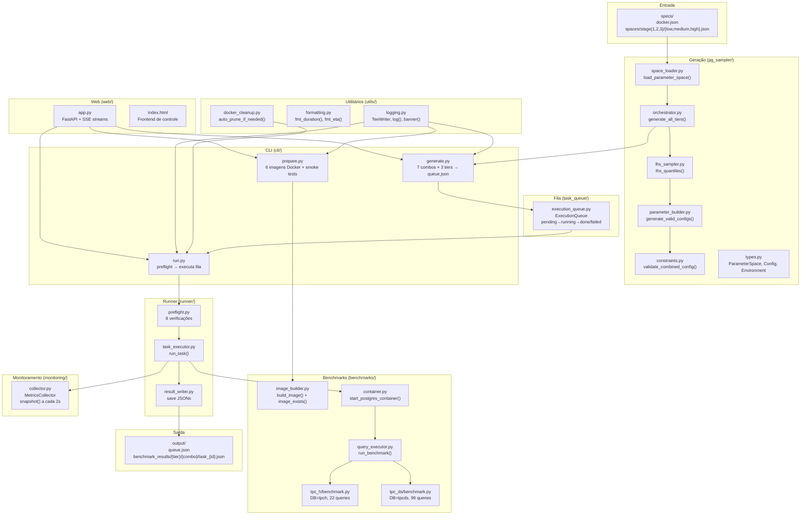
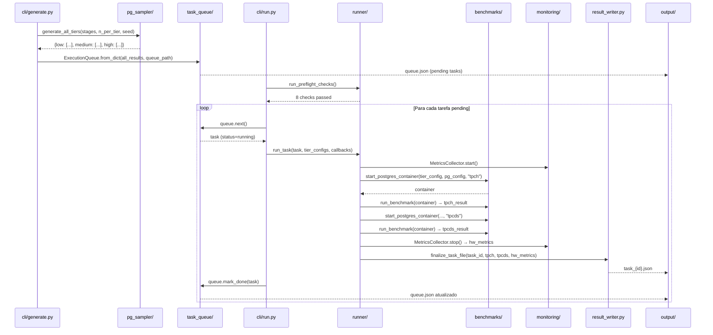

# Arquitetura do Projeto

O projeto segue uma **arquitetura em pipeline** onde cada pacote tem responsabilidade única e bem definida. Os dados fluem linearmente da geração de configurações até os resultados de benchmark, com cada etapa sendo independente o suficiente para ser executada e testada separadamente.

## Diagrama de pacotes



## Responsabilidades por pacote

### `pg_sampler/`: Geração de configurações

É o motor de geração de configurações PostgreSQL. Responsável por:

1. Carregar os espaços de parâmetros dos arquivos JSON em `specs/spaces/`
2. Aplicar **Latin Hypercube Sampling** para garantir cobertura uniforme do espaço
3. Construir configurações respeitando restrições semânticas (limites de memória, hierarquias de custo)
4. Validar cada configuração gerada contra todas as restrições conhecidas
5. Salvar o resultado em `output/queue.json` via `cli/generate.py`

Internamente, o pacote usa 3 stages de 12 parâmetros cada (36 total), com cada stage cobrindo uma dimensão diferente do sistema PostgreSQL.

### `benchmarks/`: Execução de benchmarks

Responsável por toda a interação com Docker e PostgreSQL durante a execução:

- `image_builder.py`: Constrói as 6 imagens Docker que contêm os dados TPC-H e TPC-DS pré-carregados. Cada imagem combina um benchmark (tpch/tpcds) com um scale factor (SF=1, SF=2, SF=4) para os três tiers.
- `container.py`: Inicia e para containers PostgreSQL com uma configuração específica. Valida a config antes de iniciar (detecta parâmetros inválidos), aguarda o PostgreSQL estar pronto, e fornece `InvalidConfigError` quando o PG rejeita a configuração.
- `query_executor.py`: Executa todas as queries de um benchmark, coleta `EXPLAIN ANALYZE BUFFERS`, estatísticas do `pg_stat_bgwriter`, e trata timeouts e OOM.

### `runner/`: Orquestração

Liga todos os componentes durante a execução real:

- `preflight.py`: Executa 8 verificações antes de começar (daemon Docker, espaço em disco, containers obsoletos, integridade da fila, tabelas TPC-H/DS por tier, conectividade de banco).
- `task_executor.py`: Para cada tarefa, inicia container TPC-H, executa benchmark, para container, repete para TPC-DS, tudo com timeout por tier (2h/4h/8h). Traduz exceções em ações da fila: `InvalidConfigError` → abandon, `TaskTimeoutError` → abandon, `Exception` → retry até 3×.
- `result_writer.py`: Escreve os resultados de forma incremental durante a execução (não apenas no final), permitindo recuperação em caso de crash.

### `task_queue/`: Fila persistente

`ExecutionQueue` é uma fila de tarefas com estados persistidos em `output/queue.json`. O ciclo de vida de uma tarefa é:

```
pending → running → done
                 ↘ failed → pending (até 3×)
                          ↘ abandoned
```

Na inicialização, tarefas em estado `running` são automaticamente recuperadas para `pending` (tratamento de crash/restart).

### `monitoring/`: Métricas de hardware

`MetricsCollector` coleta amostras de hardware a cada `interval_s=2.0` segundos em uma thread separada. Cada sample inclui:
- CPU: percentual, frequência MHz, temperatura (coretemp/k10temp)
- Memória: GB usados, disponíveis, percentual
- Disco: MB/s de leitura e escrita
- NVMe: temperaturas dos sensores
- GPU AMD: temperaturas edge/junction/memória (amdgpu)
- RAPL: energia em microjoules (Intel)

No final, `stop()` retorna as samples brutas e um summary com média/máximo/mínimo de cada métrica.

### `utils/`: Utilitários transversais

- `logging.py`: `TeeWriter` duplica stdout/stderr para arquivo e terminal simultaneamente. `log()` emite mensagens coloridas com nível (INFO/OK/WARN/ERROR/HEAD). `banner()` e `sep()` formatam seções no terminal.
- `formatting.py`: `fmt_duration()` formata segundos em `1h 23m 45s`. `fmt_eta()` calcula e formata o tempo restante estimado baseado no progresso.
- `docker_cleanup.py`: `auto_prune_if_needed()` limpa imagens/containers Docker quando o disco está abaixo de um threshold. Chamado a cada `PRUNE_EVERY_N_TASKS=5` tarefas pelo runner.

### `web/`: Interface de controle

`app.py` é um servidor FastAPI que expõe:
- Endpoints REST para controlar os subprocessos (generate, prepare, run)
- `GET /api/queue` para visualizar o estado da fila
- `GET /api/results/list` e `GET /api/results/{tier}/{combo}/{filename}` para inspecionar resultados
- `GET /stream/generate`, `/stream/prepare`, `/stream/runner` como streams SSE (Server-Sent Events) que transmitem os arquivos de log em tempo real para o frontend

O frontend `index.html` consome essas APIs e exibe o progresso em tempo real.

### `specs/`: Dados de configuração

Arquivos JSON que definem os parâmetros de entrada do sistema:

- `specs/docker.json`: Recursos de cada tier (cpus, memory_mb, memory_swap_mb, shm_size_mb)
- `specs/spaces/stage{N}/{tier}.json`: Para cada stage (1, 2, 3) e tier (low, medium, high), o espaço de busca de cada parâmetro: tipo (`int`, `float`, `bool`, `categorical`) e range ou valores permitidos

## Fluxo de dados end-to-end



## Decisões de design

### Por que stages de parâmetros?

A divisão em 3 stages é um **estudo de ablação**: cada stage agrupa parâmetros por tipo de impacto esperado. Isso permite comparar os resultados de modelos treinados com 12 parâmetros (apenas um stage) versus 36 parâmetros (todos os stages), medindo o custo/benefício de aumentar a dimensionalidade do espaço de busca.

### Por que LHS e não random search puro?

Com 36 parâmetros e apenas 30 configs por tier, o random search puro teria alta probabilidade de deixar regiões inteiras do espaço não cobertas. O LHS garante cobertura mínima de todas as dimensões (exatamente 1 amostra por estrato de cada parâmetro) com custo computacional idêntico ao random search.

### Por que fila persistente em JSON?

A execução de 630 tarefas leva dias. O `queue.json` permite:
1. **Retomar** após crashes ou reinicializações do sistema sem perder progresso
2. **Introspecção**: verificar o estado de qualquer tarefa a qualquer momento
3. **Retentativa automática**: tarefas falhas por erros transientes (rede, disco) são recolocadas na fila

### Por que result_writer escreve incrementalmente?

Em vez de escrever o resultado apenas ao final da tarefa, o `result_writer` escreve seções à medida que ficam disponíveis (TPC-H primeiro, depois TPC-DS, depois hw_metrics). Isso garante que, mesmo se o processo for morto durante a segunda metade de uma tarefa, os dados da primeira metade estejam preservados em disco.

### Por que containers por tarefa e não um container global?

Cada tarefa usa um conjunto diferente de parâmetros PostgreSQL (`shared_buffers`, `work_mem`, etc.). Como o PostgreSQL lê a maioria desses parâmetros na inicialização, é necessário reiniciar o servidor para cada configuração. O modelo de container efêmero garante total isolamento entre tarefas e reprodutibilidade dos resultados.
