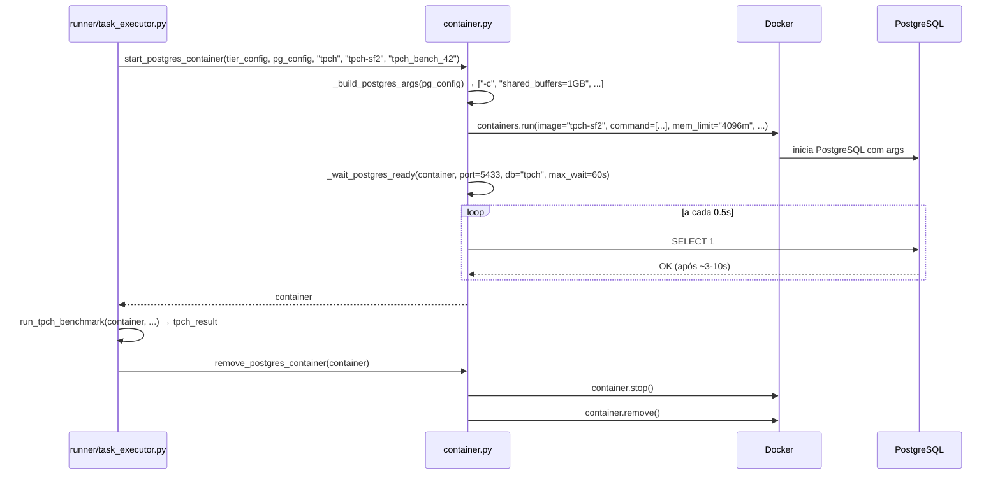

# Gerenciamento de Containers Docker

O módulo `benchmarks/container.py` é responsável por criar, configurar e remover os containers PostgreSQL usados durante os benchmarks. É o ponto de integração entre as configurações PostgreSQL geradas pelo `pg_sampler` e o Docker.

## Funções principais

### `start_postgres_container`

```python
def start_postgres_container(
    tier_config: dict,
    pg_config: dict,
    db_name: str,
    image: str,
    container_name: str,
    host_port: int = 5432,
    max_wait_s: float = 60.0,
    log_fn: Callable | None = None,
) -> docker.models.containers.Container
```

Inicia um container PostgreSQL com uma configuração específica. Esta é a função central do módulo.

**Parâmetros:**

| Parâmetro | Tipo | Descrição |
|-----------|------|-----------|
| `tier_config` | `dict` | Recursos do tier: `cpu`, `memory_mb`, `memory_swap_mb`, `shm_size_mb` |
| `pg_config` | `dict` | Configuração PostgreSQL: `{param: valor}` gerada pelo pg_sampler |
| `db_name` | `str` | Nome do banco de dados (`"tpch"` ou `"tpcds"`) |
| `image` | `str` | Tag da imagem Docker (ex: `"tpch-sf2"`) |
| `container_name` | `str` | Nome do container (ex: `"tpch_bench_42"`) |
| `host_port` | `int` | Porta do host mapeada para a porta 5432 do PostgreSQL |
| `max_wait_s` | `float` | Tempo máximo de espera para o PostgreSQL ficar pronto (segundos) |
| `log_fn` | `Callable \| None` | Função de logging opcional (recebe uma string de mensagem) |

**Retorna:** Objeto `Container` do Docker SDK Python.

**Lança:**
- `InvalidConfigError` — se a configuração PostgreSQL contiver parâmetros inválidos (detectados antes de iniciar ou pelo `pg_isready`/logs do container)
- `RuntimeError` — se o container não ficar pronto dentro de `max_wait_s`

**Exemplo de uso:**

```python
from benchmarks.container import start_postgres_container, remove_postgres_container

tier_config = {
    "cpu": 4,
    "memory_mb": 4096,
    "memory_swap_mb": 4096,
    "shm_size_mb": 1152
}

pg_config = {
    "shared_buffers": "1GB",
    "work_mem": "64MB",
    "max_parallel_workers": 4,
    "jit": 1,
    # ... outros parâmetros
}

container = start_postgres_container(
    tier_config=tier_config,
    pg_config=pg_config,
    db_name="tpch",
    image="tpch-sf2",
    container_name="tpch_bench_42",
    host_port=5433,
)

# ... executar benchmark ...

remove_postgres_container(container)
```

### `remove_postgres_container`

```python
def remove_postgres_container(container: docker.models.containers.Container) -> None
```

Para e remove um container Docker. Equivalente a `docker stop <container> && docker rm <container>`. Não lança exceção se o container já foi removido.

### `InvalidConfigError`

```python
class InvalidConfigError(Exception):
    pass
```

Exceção lançada quando o PostgreSQL rejeita a configuração fornecida. Isso pode ocorrer porque:

1. Um parâmetro tem valor fora do range aceito pelo PostgreSQL (ex: `work_mem` negativo)
2. Uma combinação de parâmetros é semanticamente inválida (ex: `min_wal_size > max_wal_size`)
3. Um parâmetro não existe na versão do PostgreSQL instalada na imagem

Quando esta exceção é lançada, o runner a captura e chama `queue.mark_abandoned()` — sem retry, pois a config é intrinsecamente inválida.

## Funções internas

### `_build_postgres_args`

```python
def _build_postgres_args(pg_config: dict) -> list[str]
```

Converte o dicionário de configuração PostgreSQL em argumentos de linha de comando para o processo `postgres`:

```python
pg_config = {"shared_buffers": "1GB", "work_mem": "64MB"}
# → ["-c", "shared_buffers=1GB", "-c", "work_mem=64MB"]
```

Esses argumentos são passados como `command` para o container Docker, sobrescrevendo os valores padrão do `postgresql.conf` dentro da imagem.

### `_is_invalid_pg_config`

```python
def _is_invalid_pg_config(container_logs: str) -> bool
```

Analisa os logs do container para detectar mensagens de erro do PostgreSQL que indicam configuração inválida. Busca por padrões como:

- `FATAL: invalid value for parameter`
- `FATAL: configuration file contains errors`
- `FATAL: could not resize shared memory`

Se encontrado, lança `InvalidConfigError` com a mensagem de erro extraída dos logs.

### `_wait_postgres_ready`

```python
def _wait_postgres_ready(
    container: Container,
    host_port: int,
    db_name: str,
    max_wait_s: float,
) -> None
```

Aguarda o PostgreSQL ficar pronto para aceitar conexões. A cada 0.5 segundos:
1. Verifica se o container ainda está em execução (pode ter crashado com config inválida)
2. Tenta conectar ao PostgreSQL via `psycopg2`
3. Executa `SELECT 1` para verificar que o banco está operacional

Se o container parar antes de `max_wait_s`, analisa os logs para detectar `InvalidConfigError`.

## Como o Docker é configurado

O container é criado com os seguintes parâmetros Docker:

```python
docker_client.containers.run(
    image=image,
    name=container_name,
    command=postgres_args,        # -c param=val -c param=val ...
    detach=True,
    remove=False,                 # removido explicitamente após uso
    mem_limit=f"{memory_mb}m",
    memswap_limit=f"{memory_swap_mb}m",  # swap desabilitado quando == mem_limit
    shm_size=f"{shm_size_mb}m",
    nano_cpus=int(cpu * 1e9),    # limite de CPU via cgroups
    ports={"5432/tcp": host_port},
    environment={
        "POSTGRES_HOST_AUTH_METHOD": "trust",
        "PGDATA": "/var/lib/postgresql/data",
    },
)
```

**Por que `memswap_limit == mem_limit`?**

No Docker, `memswap_limit` define o limite total de memória + swap. Quando `memswap_limit == mem_limit`, o swap fica efetivamente desabilitado. Isso é intencional: queremos que o OOM killer mate o container se ele ultrapassar o limite de RAM, pois queries que causam OOM são resultados legítimos (capturados como `failure_reason="oom"`).

**Por que `shm_size` separado?**

O PostgreSQL usa memória compartilhada POSIX para o `shared_buffers`. No Docker, a memória compartilhada é mapeada em `/dev/shm` e tem um limite separado do limite de RAM. Se `shm_size` for menor que `shared_buffers`, o PostgreSQL falha ao iniciar com `FATAL: could not resize shared memory`. Por isso, `specs/docker.json` define `shm_size_mb` como ~28% da RAM de cada tier, garantindo que o maior valor de `shared_buffers` possível no espaço de busca ainda caiba no `/dev/shm`.

## Ciclo de vida de um container durante um benchmark


