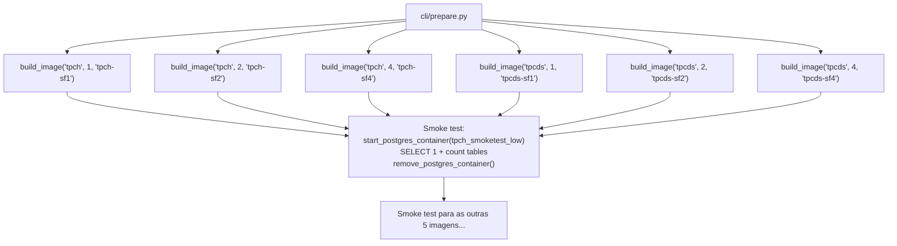

# Imagens Docker

O módulo `benchmarks/image_builder.py` é responsável por construir as 6 imagens Docker que contêm os dados TPC-H e TPC-DS pré-carregados. Construir as imagens é uma etapa única: uma vez criadas, elas são reutilizadas em todas as execuções de benchmark.

## Constantes

### `TIER_IMAGE_TAGS`

```python
TIER_IMAGE_TAGS = {
    "tpch": {
        "low":    "tpch-sf1",
        "medium": "tpch-sf2",
        "high":   "tpch-sf4",
    },
    "tpcds": {
        "low":    "tpcds-sf1",
        "medium": "tpcds-sf2",
        "high":   "tpcds-sf4",
    },
}
```

Mapeia `(benchmark, tier)` para a tag da imagem Docker correspondente. Usado pelo runner para saber qual imagem iniciar para cada tarefa.

### `TIER_SCALE_FACTORS`

```python
TIER_SCALE_FACTORS = {
    "low": 1,
    "medium": 2,
    "high": 4,
}
```

Mapeia cada tier para o Scale Factor TPC correspondente.

## Funções

### `build_image`

```python
def build_image(
    benchmark: str,
    scale_factor: int,
    image_tag: str,
) -> None
```

Constrói uma imagem Docker com os dados TPC pré-carregados.

**Parâmetros:**

| Parâmetro | Tipo | Descrição |
|-----------|------|-----------|
| `benchmark` | `str` | `"tpch"` ou `"tpcds"` |
| `scale_factor` | `int` | `1`, `2` ou `4` |
| `image_tag` | `str` | Tag da imagem resultante (ex: `"tpch-sf2"`) |

**Processo:**

1. Verifica se a imagem já existe via `image_exists()`: se sim, retorna imediatamente
2. Cria um container temporário `{benchmark}-build-tmp-sf{scale_factor}` a partir de uma imagem base PostgreSQL com os scripts de inicialização TPC
3. Aguarda o script de init completar (`_wait_init_complete`): pode levar de 5 minutos (SF=1) a 1 hora (TPC-DS SF=4)
4. Para o container e faz commit como imagem com a `image_tag`
5. Remove o container temporário

**Por que fazer commit da imagem?**

Os dados TPC-H e TPC-DS precisam ser gerados (via `dbgen`/`dsdgen`) e carregados no PostgreSQL. Esse processo é lento (especialmente o TPC-DS com SF=4). Ao commitar os dados como uma imagem Docker, o carregamento acontece apenas uma vez. Nas execuções subsequentes, o container inicia com os dados já presentes, e apenas os parâmetros PostgreSQL mudam.

### `image_exists`

```python
def image_exists(image_tag: str) -> bool
```

Verifica se uma imagem Docker com a tag especificada já existe localmente.

```python
from benchmarks.image_builder import image_exists

if not image_exists("tpch-sf2"):
    build_image("tpch", 2, "tpch-sf2")
```

### `_wait_init_complete`

```python
def _wait_init_complete(container, timeout_s: float = 3600.0) -> None
```

Função interna que aguarda o script de inicialização TPC completar dentro do container. O script de init:

1. Executa `dbgen` (TPC-H) ou `dsdgen` (TPC-DS) para gerar os arquivos de dados
2. Carrega os dados nas tabelas PostgreSQL via `COPY`
3. Cria índices e executa `ANALYZE`
4. Escreve um arquivo sentinel (ex: `/var/lib/postgresql/data/init_done`) ao concluir

`_wait_init_complete` verifica a presença desse sentinel a cada 10 segundos, até `timeout_s=3600` (1 hora) de timeout.

## Fluxo do `cli/prepare.py`

O `cli/prepare.py` chama `build_image` para todas as 6 combinações e depois executa smoke tests:



**Smoke test em detalhes:**

Para cada imagem, o prepare:
1. Inicia container `{db_name}_smoketest_{tier}` com configurações padrão (sem pg_config especial)
2. Executa `SELECT 1` para verificar conectividade básica
3. Conta o número de tabelas no banco (`SELECT count(*) FROM information_schema.tables WHERE table_schema = 'public'`)
4. Verifica que a contagem bate com o esperado (8 tabelas para TPC-H, 24 para TPC-DS)
5. Para e remove o container

Se qualquer smoke test falhar, `cli/prepare.py` reporta o erro mas continua com as demais imagens.

## Estimativas de tempo e espaço

| Imagem | Build (primeira vez) | Espaço em disco |
|--------|---------------------|-----------------|
| tpch-sf1 | ~5-10 minutos | ~1.5 GB |
| tpch-sf2 | ~10-20 minutos | ~3 GB |
| tpch-sf4 | ~20-40 minutos | ~6 GB |
| tpcds-sf1 | ~15-30 minutos | ~2 GB |
| tpcds-sf2 | ~30-60 minutos | ~4 GB |
| tpcds-sf4 | ~60-120 minutos | ~8 GB |
| **Total** | **~2-5 horas** | **~25 GB** |

!!! tip "Rebuild seletivo"
    Se uma imagem for corrompida ou precisar ser recriada, basta remover a imagem Docker localmente:
    ```bash
    docker rmi tpcds-sf4
    python -m cli.prepare   # recriará apenas tpcds-sf4
    ```
    As demais imagens são detectadas como existentes e puladas.
