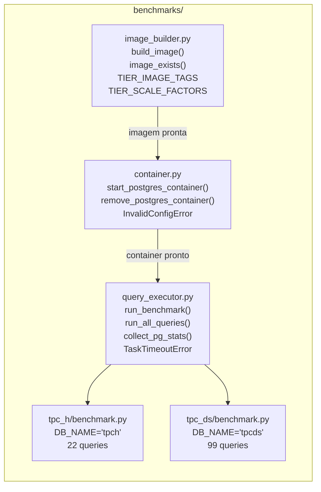

# Benchmarks TPC-H e TPC-DS

O pacote `benchmarks/` contém toda a lógica de execução dos benchmarks analíticos. Ele é responsável por gerenciar containers Docker, executar queries PostgreSQL, coletar estatísticas e tratar falhas.

## Visão geral

## Os dois benchmarks

### TPC-H

O TPC-H é um benchmark analítico que simula um sistema de suporte à decisão (DSS) para uma empresa de vendas de peças. Consiste em **22 queries** que testam diferentes aspectos de performance:

- Agregações complexas com GROUP BY
- Joins de múltiplas tabelas (até 8 tabelas)
- Subqueries correlacionadas
- HAVING clauses
- ORDER BY com LIMIT

Todas as 22 queries são executadas em sequência, cada uma com timeout de 15 minutos. O banco de dados é `tpch`.

### TPC-DS

O TPC-DS é um benchmark analítico mais complexo que simula um retailer multi-canal. Consiste em **99 queries** que cobrem:

- Window functions (`RANK`, `ROW_NUMBER`, `SUM OVER`)
- CTEs (Common Table Expressions) aninhadas
- Queries de rollup e cube
- Cross-joins e produtos cartesianos controlados

O TPC-DS é significativamente mais exigente que o TPC-H, especialmente para `enable_windowagg` e `enable_incremental_sort`. O banco de dados é `tpcds`.

## Scale Factors

| Tier | Scale Factor | Tamanho do banco (aprox.) |
|------|--------------|--------------------------|
| low | SF=1 | ~1 GB |
| medium | SF=2 | ~2 GB |
| high | SF=4 | ~4 GB |

O Scale Factor multiplica o volume de dados de todas as tabelas. SF=4 significa 4× mais dados que SF=1, tornando as queries proporcionalmente mais lentas e exercitando mais as estratégias de paralelismo.

## Nomes de containers

O projeto usa nomes de container padronizados para identificar a origem de cada container:

| Operação | Padrão | Exemplo |
|----------|--------|---------|
| Build de imagem | `{db_name}-build-tmp-sf{N}` | `tpch-build-tmp-sf2` |
| Preflight check | `{db_name}_conntest_{tier}` | `tpcds_conntest_high` |
| Smoke test (prepare) | `{db_name}_smoketest_{tier}` | `tpch_smoketest_medium` |
| Execução de benchmark | `{db_name}_bench_{task_id}` | `tpcds_bench_42` |

## Imagens Docker

| Tag da imagem | Benchmark | Scale Factor | Usado no tier |
|--------------|-----------|--------------|---------------|
| `tpch-sf1` | TPC-H | 1 | low |
| `tpch-sf2` | TPC-H | 2 | medium |
| `tpch-sf4` | TPC-H | 4 | high |
| `tpcds-sf1` | TPC-DS | 1 | low |
| `tpcds-sf2` | TPC-DS | 2 | medium |
| `tpcds-sf4` | TPC-DS | 4 | high |

## Timeouts e tratamento de falhas

Cada query tem um timeout individual de **15 minutos** (`_QUERY_TIMEOUT_MS = 900_000`). Quando uma query falha, o resultado registra:

| Motivo (`failure_reason`) | Significado | `exec_ms` imputado |
|--------------------------|-------------|-------------------|
| `"ok"` | Query executou com sucesso | valor real |
| `"timeout"` | `statement_timeout` excedido | `_IMPUTE_TIMEOUT_MS` |
| `"oom"` | Container morto pelo OOM killer | `_IMPUTE_OOM_MS` |
| `"technical"` | Erro técnico (conexão, sintaxe) | 0 |

Queries com falha não interrompem o benchmark: as demais queries continuam sendo executadas.

## Páginas desta seção

- [**Containers Docker**](containers.md): `container.py`: como containers são criados, configurados e removidos
- [**Imagens Docker**](imagens.md): `image_builder.py`: como as imagens são construídas com dados TPC pré-carregados
- [**Execução de Queries**](queries.md): `query_executor.py`: como queries são executadas e estatísticas coletadas
