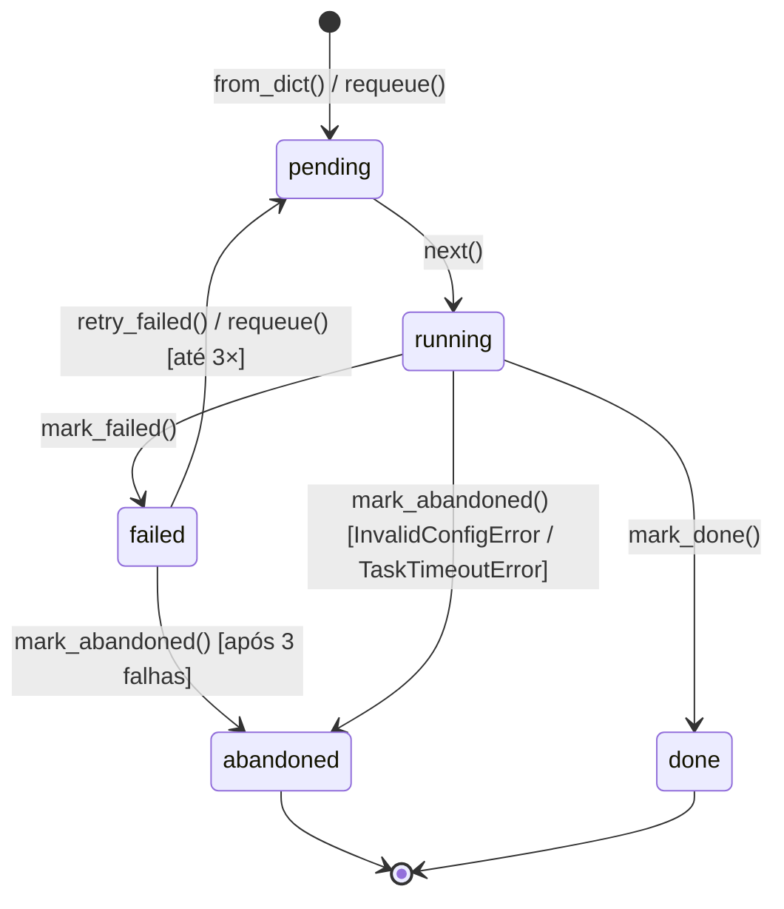

# Fila de Execução

O módulo `task_queue/execution_queue.py` implementa a **`ExecutionQueue`**: uma fila de tarefas persistente que rastreia o progresso da execução de benchmarks e permite retomar após interrupções.

## Motivação

A execução de 630 tarefas de benchmark pode levar vários dias. Durante esse tempo:

- O processo pode ser interrompido (SIGINT, reinicialização do sistema, falta de energia)
- Tarefas podem falhar por erros transientes (rede, disco cheio, Docker instável)
- O operador pode querer inspecionar o progresso a qualquer momento

A `ExecutionQueue` resolve esses problemas mantendo o estado de todas as tarefas em `output/queue.json`, com suporte a retentativas automáticas e recuperação após crash.

## Ciclo de vida de uma tarefa



| Estado | Significado |
|--------|-------------|
| `pending` | Aguardando execução |
| `running` | Em execução no momento |
| `done` | Concluída com sucesso |
| `failed` | Falhou, aguardando retry (até 3×) |
| `abandoned` | Falhou permanentemente ou foi descartada |

**Recuperação automática na inicialização:** Tarefas em estado `running` ao carregar a fila (indicando crash/restart do processo anterior) são automaticamente revertidas para `pending`. Isso garante que nenhuma tarefa fique presa no estado `running` após uma reinicialização.

## Estrutura de uma tarefa

```json
{
  "id": 42,
  "combination": "s1s2",
  "tier": "medium",
  "config": {
    "shared_buffers": "1GB",
    "work_mem": "64MB",
    "max_parallel_workers": 4,
    "hash_mem_multiplier": 2.5,
    "enable_hashjoin": 1,
    "jit": 0
  },
  "status": "pending",
  "result": null,
  "error": null
}
```

| Campo | Tipo | Descrição |
|-------|------|-----------|
| `id` | int | Identificador único da tarefa |
| `combination` | str | Rótulo da combinação de stages (ex: `"s1s2"`, `"s1s2s3"`) |
| `tier` | str | Tier de hardware (`"low"`, `"medium"`, `"high"`) |
| `config` | dict | Configuração PostgreSQL gerada pelo pg_sampler |
| `status` | str | Estado atual da tarefa |
| `result` | dict\|null | Resultado da execução (quando concluída) |
| `error` | str\|null | Mensagem de erro (quando falhou/abandonada) |

## API da `ExecutionQueue`

### Construção

#### `from_dict`

```python
@classmethod
def from_dict(
    cls,
    all_results: dict,
    queue_path: str,
) -> "ExecutionQueue"
```

Cria ou carrega uma fila. Se `queue_path` já existir, carrega o estado anterior (permitindo retomar). Se não existir, cria uma nova fila a partir de `all_results`.

`all_results` tem o formato:

```python
{
    "s1": {
        "low":    [Config, ...],  # lista de dicts de config
        "medium": [Config, ...],
        "high":   [Config, ...],
    },
    "s2": {...},
    # ... outras combinações
}
```

Cada `Config` vira uma tarefa com `status="pending"`. As tarefas em estado `running` ao carregar são revertidas para `pending`.

**Exemplo de uso em `cli/generate.py`:**

```python
from task_queue.execution_queue import ExecutionQueue
from pg_sampler import generate_all_tiers

all_results = {}
for stages in [[1], [2], [3], [1,2], [1,3], [2,3], [1,2,3]]:
    combo_label = stages_label(stages)
    all_results[combo_label] = generate_all_tiers(stages, n_per_tier=10, seed=42)

queue = ExecutionQueue.from_dict(all_results, "output/queue.json")
# Salva automaticamente em output/queue.json
```

### Operações de execução

#### `next`

```python
def next(self) -> dict | None
```

Retorna a próxima tarefa `pending` e a marca como `running`. Retorna `None` se não houver tarefas pendentes.

Persiste automaticamente o novo estado em `queue.json`.

```python
while (task := queue.next()) is not None:
    try:
        result = run_task(task)
        queue.mark_done(task)
    except Exception as e:
        queue.mark_failed(task, str(e))
```

#### `mark_done`

```python
def mark_done(self, task: dict, result: dict | None = None) -> None
```

Marca uma tarefa como concluída. O `result` é armazenado no campo `result` da tarefa (opcional: o resultado real é salvo separadamente pelo `result_writer`).

#### `mark_failed`

```python
def mark_failed(self, task: dict, error: str | None = None) -> None
```

Marca uma tarefa como falha. Incrementa o contador de tentativas. Se o contador atingir 3, chama automaticamente `mark_abandoned()`.

#### `mark_abandoned`

```python
def mark_abandoned(self, task: dict, reason: str | None = None) -> None
```

Marca uma tarefa como abandonada permanentemente. Usada para:
- `InvalidConfigError`: configuração inválida → sem retry possível
- `TaskTimeoutError`: timeout por tier → sem retry
- Após 3 falhas consecutivas em `mark_failed()`

#### `requeue`

```python
def requeue(self, task: dict) -> None
```

Recoloca uma tarefa como `pending`. Usado pelo runner para retry manual de tarefas falhas após corrigir a causa raiz.

#### `retry_failed`

```python
def retry_failed(self) -> int
```

Recoloca **todas** as tarefas `failed` de volta para `pending`. Retorna o número de tarefas recolocadas. Acessível via `cli/run.py --retry-failed`.

```python
n = queue.retry_failed()
print(f"Recolocou {n} tarefas para retry")
```

### Consultas de estado

#### `stats`

```python
def stats(self) -> dict
```

Retorna um dicionário com a contagem de tarefas por estado:

```python
{
    "pending": 150,
    "running": 1,
    "done": 420,
    "failed": 3,
    "abandoned": 56,
    "total": 630,
}
```

#### `pending`, `done`, `failed`, `abandoned`

```python
def pending(self) -> list[dict]
def done(self) -> list[dict]
def failed(self) -> list[dict]
def abandoned(self) -> list[dict]
```

Retornam listas de tarefas filtradas por estado.

## Implementação interna

### Estrutura de dados

Internamente, a fila usa um `deque` (double-ended queue) para eficiência:

```python
from collections import deque

self._queue: deque[dict] = deque()
self._by_id: dict[int, dict] = {}  # acesso O(1) por id
```

O `deque` permite `popleft()` O(1) para obter a próxima tarefa, e `append()` O(1) para recolocar tarefas no final.

### Persistência

Toda operação que muda o estado (next, mark_done, mark_failed, etc.) persiste o estado completo em `queue.json`:

```python
def _save(self) -> None:
    with open(self._queue_path, "w") as f:
        json.dump({
            "tasks": list(self._queue),
            "by_id": self._by_id,
        }, f, indent=2)
```

A escrita é síncrona (não usa escrita atômica com arquivo temporário), mas o formato JSON é suficientemente simples para que gravações parciais sejam facilmente detectadas na inicialização.

### Retentativas automáticas

O campo `_retry_count` (interno a cada tarefa dict) rastreia o número de tentativas:

```python
def mark_failed(self, task: dict, error: str | None = None) -> None:
    task["error"] = error
    task["_retry_count"] = task.get("_retry_count", 0) + 1
    if task["_retry_count"] >= 3:
        self.mark_abandoned(task, f"Abandonada após 3 falhas: {error}")
    else:
        task["status"] = "failed"
        # Recoloca no final da fila para retry posterior
        self._queue.append(task)
    self._save()
```

O `cli/run.py` tem `_MAX_RETRIES=3`: consistente com a lógica interna da fila.

## Integração com o runner

```python
# cli/run.py (simplificado)
from task_queue.execution_queue import ExecutionQueue
from runner.task_executor import run_task, InvalidConfigError, TaskTimeoutError

queue = ExecutionQueue.from_dict({}, "output/queue.json")  # carrega existente

while (task := queue.next()) is not None:
    try:
        tpch_result, tpcds_result, hw_metrics = run_task(task, tier_configs, ...)
        queue.mark_done(task)

    except InvalidConfigError as e:
        # PostgreSQL rejeitou a config → sem retry
        queue.mark_abandoned(task, str(e))

    except TaskTimeoutError as e:
        # Timeout do tier → sem retry
        queue.mark_abandoned(task, str(e))

    except Exception as e:
        # Erro transiente → retry até 3×
        queue.mark_failed(task, str(e))
        # Se _retry_count ≥ 3, mark_failed já chama mark_abandoned
```
