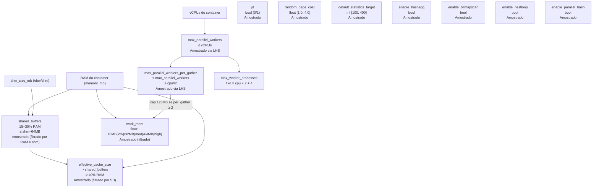

# Stages e Espaços de Parâmetros

Os 36 parâmetros do projeto estão organizados em 3 stages de 12 parâmetros cada. Os arquivos de configuração dos espaços de busca estão em `specs/spaces/stage{N}/{tier}.json`.

## Como os espaços de parâmetros são definidos

Cada arquivo JSON em `specs/spaces/` define, para cada parâmetro, como o LHS deve amostrar valores:

```json
{
  "shared_buffers": {
    "type": "categorical",
    "choices": ["512MB", "768MB", "1GB"]
  },
  "max_parallel_workers": {
    "type": "int",
    "min": 1,
    "max": 2
  },
  "random_page_cost": {
    "type": "float",
    "min": 1.0,
    "max": 4.0
  },
  "jit": {
    "type": "bool"
  }
}
```

Os ranges diferem por tier: o tier `high` tem ranges maiores (mais RAM, mais CPUs):

```json
// specs/spaces/stage1/low.json
{ "shared_buffers": {"choices": ["256MB", "512MB", "768MB"]} }

// specs/spaces/stage1/medium.json
{ "shared_buffers": {"choices": ["512MB", "1GB", "1.5GB", "2GB"]} }

// specs/spaces/stage1/high.json
{ "shared_buffers": {"choices": ["1GB", "1.5GB", "2GB", "3GB", "4GB"]} }
```

## Carregamento dos espaços (`space_loader.py`)

### `load_parameter_space`

```python
def load_parameter_space(path: str) -> ParameterSpace
```

Carrega um arquivo JSON de espaço de parâmetros. Retorna um `ParameterSpace` (dict `{param_name: spec_dict}`).

### `load_stage_spaces`

```python
def load_stage_spaces(stages: list[int], tier: str) -> StageSpaces
```

Carrega os espaços de parâmetros para todos os stages especificados e um tier. Retorna `StageSpaces` (dict `{stage_num: ParameterSpace}`).

```python
# Carrega stage 1 e 2 para tier "medium"
spaces = load_stage_spaces([1, 2], "medium")
# spaces[1] = {"shared_buffers": {...}, "work_mem": {...}, ...}
# spaces[2] = {"hash_mem_multiplier": {...}, "join_collapse_limit": {...}, ...}
```

### `load_docker_config`

```python
def load_docker_config(path: str, tier: str) -> Environment
```

Carrega as especificações de hardware do tier a partir de `specs/docker.json`:

```python
env = load_docker_config("specs/docker.json", "medium")
# env = {"cpu": 4, "memory_mb": 4096, "memory_swap_mb": 4096, "shm_size_mb": 1152}
```

### `save_configs`

```python
def save_configs(configs: dict, output_path: str) -> None
```

Salva o dicionário `{tier: [Config, ...]}` em um arquivo JSON. Usado por `cli/generate.py` para salvar as configurações geradas (embora a forma principal de persistência seja via `ExecutionQueue`).

## Stage 1: Memória, Paralelismo, WAL, Planner Básico

### Dependências entre parâmetros

A ordem de preenchimento no `_fill_stage1()` importa porque alguns parâmetros dependem de outros:



### Parâmetros fixos do Stage 1

Três parâmetros do Stage 1 não são amostrados pelo LHS:

1. **`seq_page_cost = 1.0`**: Âncora do planner. Manter fixo e variar `random_page_cost` explora toda a relação relevante.

2. **`max_worker_processes = cpu × 2 + 4`**: Pool de processos background. Calculado automaticamente para garantir que há sempre workers disponíveis para autovacuum além dos workers paralelos.

3. **`synchronous_commit = "off"`**: Desabilitado para todos os benchmarks porque TPC-H e TPC-DS são workloads SELECT-only: commits não afetam a performance medida.

### Restrições de memória por tier

O espaço de busca de `shared_buffers` é restrito por tier para garantir que os valores gerados sejam realistas:

| Tier | RAM | shm_size | Range de shared_buffers |
|------|-----|----------|------------------------|
| low | 2 GB | 576 MB | 256–512 MB |
| medium | 4 GB | 1.152 MB | 512 MB – 1.5 GB |
| high | 6 GB | 1.536 MB | 768 MB – 2 GB |

O `work_mem` tem floors por tier para evitar configurações com hash joins e sorts inviáveis:

| Tier | Floor do work_mem |
|------|------------------|
| low | 16 MB |
| medium | 32 MB |
| high | 64 MB |

## Stage 2: Custos de CPU, Paralelismo Fino, Planejamento de Joins

### Hierarquia semântica dos custos de CPU

O PostgreSQL tem uma hierarquia natural entre os custos:

```
cpu_operator_cost ≤ cpu_index_tuple_cost ≤ cpu_tuple_cost
```

O `_fill_stage2()` garante essa hierarquia durante a geração, e o `_validate_stage2()` verifica-a na validação.

**Por quê essa hierarquia?** Semanticamente, processar o resultado final de uma operação (tuple cost) é mais caro que processar uma entrada de índice (index tuple cost), que por sua vez é mais caro que avaliar um operador isolado. Inverter essa hierarquia faria o planner preferir estratégias semanticamente mais caras por erros de custo.

### `hash_mem_multiplier`: multiplicador de work_mem

Este parâmetro é de impacto **muito alto** em OLAP. Ele define quanto de memória um hash join pode usar **além do `work_mem`**:

```
hash_join_memory = work_mem × hash_mem_multiplier
```

Com `work_mem=64MB` e `hash_mem_multiplier=3.0`, um hash join pode usar até 192 MB: permitindo hash joins maiores sem spill para disco.

O range no Stage 2 é `[1.0, 4.0]`. Valores mais altos são mais agressivos e devem ser validados contra a memória total disponível.

### `min_parallel_table_scan_size` e `min_parallel_index_scan_size`

Esses thresholds controlam quando o planner considera usar paralelismo para um scan:

- Se a tabela (ou índice) for menor que o threshold, o planner não usa paralelismo para esse scan, mesmo que `max_parallel_workers > 0`
- Valores menores → mais scans usam paralelismo → mais workers são utilizados
- Valores maiores → só tabelas grandes usam paralelismo → workers mais ociosos

**Constraint**: `min_parallel_table_scan_size ≥ min_parallel_index_scan_size`: tabelas inteiras precisam de mais dados para justificar o overhead de paralelismo do que índices.

## Stage 3: Toggles Avançados, I/O Background

### Toggles do planner (enable_*)

O Stage 3 contém 8 toggles booleanos que habilitam ou desabilitam estratégias específicas do planner:

| Toggle | Quando desabilitar |
|--------|-------------------|
| `enable_memoize` | Se memória é escassa (memoize usa memória de forma não contabilizada) |
| `enable_gathermerge` | Se ORDER BY paralelo não é necessário |
| `enable_incremental_sort` | Se os dados raramente vêm parcialmente ordenados |
| `enable_material` | Se memória é muito restrita |
| `enable_indexscan` | Raramente (apenas para forçar seqscans em benchmarks de I/O) |
| `enable_indexonlyscan` | Raramente |
| `enable_parallel_append` | Se UNION ALL não é frequente no workload |
| `enable_windowagg` | **Nunca desabilitar para TPC-DS**: window functions são críticas |

Para o TPC-DS, `enable_windowagg=0` causa degradação severa pois desabilita window functions como `RANK()`, `ROW_NUMBER()` e `SUM() OVER` presentes em dezenas das 99 queries.

### `checkpoint_completion_target`

Controla em qual fração do intervalo de checkpoint os writes são espalhados:

- `0.5` → escritas concentradas na primeira metade do intervalo → picos de I/O
- `0.9` → escritas espalhadas por 90% do intervalo → I/O mais suave

Para benchmarks SELECT-only como TPC-H/DS, o impacto é baixo (poucos dirty pages sendo escritos). Mas pode afetar queries que causam spill para disco.

### `bgwriter_lru_maxpages`

Número de páginas que o background writer limpa por round. Valores maiores → bgwriter é mais agressivo → menos pressure sobre backends e checkpoints → potencialmente melhor latência.

**Constraint com `bgwriter_delay`**: Se `bgwriter_lru_maxpages ≥ 400`, o delay mínimo é forçado acima de 50ms para evitar I/O contínuo no filesystem overlay2 do Docker.

### `wal_buffers`

Buffer de WAL em memória compartilhada. Para workloads SELECT-only, o impacto é mínimo. O range típico é 1–16 MB, e o valor é limitado a um percentual de `shared_buffers` para não desperdiçar memória compartilhada.

## Construção incremental de configurações (`parameter_builder.py`)

### `generate_combined_config`

```python
def generate_combined_config(
    stage_spaces: StageSpaces,
    env: Environment,
    stages: list[int],
    quantiles: dict[str, float] | None = None,
) -> Config
```

Gera uma única configuração PostgreSQL chamando `_fill_stage1/2/3()` em sequência. O `config` dict é passado por referência e acumulado: stages posteriores podem usar valores já preenchidos por stages anteriores.

### `generate_valid_configs`

```python
def generate_valid_configs(
    stage_spaces: StageSpaces,
    env: Environment,
    stages: list[int],
    n: int,
    max_attempts: int = 100_000,
    seed: int | None = None,
) -> list[Config]
```

Gera `n` configurações válidas e únicas:

1. Chama `diagnose_combined()` para verificar invariantes do espaço de parâmetros
2. Gera `n` conjuntos de quantis via `lhs_quantiles(n, stages, seed)`
3. Para cada slot LHS:
   - Tentativa 1: usa o quantil LHS → `generate_combined_config(..., quantiles)`
   - Se inválido ou duplicado: tentativas 2–`max_attempts` com `quantiles=None` (aleatório puro)
   - Se `max_attempts` esgotados: lança `RuntimeError`

**Na prática**, a taxa de rejeição é próxima de 0% porque o `_fill_stage*()` já incorpora a maioria das constraints durante a construção (filtros de memória, floors, caps). A validação serve como rede de segurança.

### `_fill_stage1`, `_fill_stage2`, `_fill_stage3`

Funções internas que preenchem os parâmetros de cada stage em ordem de dependência. A assinatura geral é:

```python
def _fill_stage1(config: Config, ps: dict, env: Environment, q: dict) -> None
#                config = dict acumulador (modificado in-place)
#                ps = ParameterSpace do stage 1 (do JSON)
#                env = {"cpu": 4, "memory_mb": 4096, ...}
#                q = {"param_name": quantil, ...} ou dict vazio para aleatório
```

**Guidance cross-stage**: quando `_fill_stage2()` é chamado, o `config` já contém os valores do Stage 1 (se Stage 1 foi incluído). `_fill_stage2` verifica se `"shared_buffers" in config` para usar um cap preciso de `wal_buffers = 5% × shared_buffers`, em vez da proxy conservadora de `1.5% × RAM`.

Similarmente, `_fill_stage3()` verifica se `max_worker_processes` e `max_parallel_workers` estão no `config` para calcular `autovacuum_max_workers ≤ mwp - mpw`.
