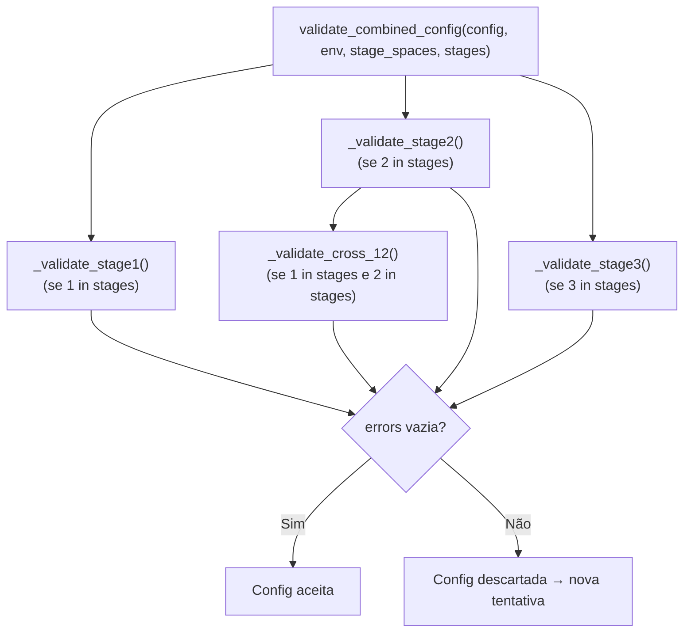

# Restrições e Validação

O módulo `pg_sampler/constraints.py` implementa duas camadas de verificação:

1. **Diagnóstico preventivo** (`diagnose_combined`): verifica invariantes estruturais dos **espaços de parâmetros** antes de gerar qualquer configuração
2. **Validação de instância** (`validate_combined_config`): verifica se uma configuração específica é semanticamente válida e não causará problemas em produção

## Por que a validação existe se o builder já aplica constraints?

O `parameter_builder.py` aplica floors, caps e filtros **durante** a construção — mas a validação existe por razões complementares:

**1. Verificar propriedades emergentes**: A estimativa de pico de memória `shared_buffers + work_mem × per_gather × 3` só pode ser verificada após todos os parâmetros terem valores — não é possível aplicá-la na geração de cada parâmetro individualmente.

**2. Segurança contra corrupção**: Se um arquivo JSON de espaço de parâmetros tiver valores inconsistentes, o builder pode gerar uma config que passa na geração mas viola uma constraint na validação.

**3. Verificação cross-stage**: O guidance cross-stage tenta aplicar constraints durante a geração, mas um quantil LHS específico pode colocar um parâmetro numa região que viola outra constraint quando combinado com o valor já gerado de outro stage.

## Diagnóstico preventivo — `diagnose_combined`

```python
def diagnose_combined(stage_spaces: StageSpaces, stages: list[int]) -> None
```

Executa antes de qualquer geração. Se qualquer invariante falhar, lança `RuntimeError` imediatamente.

**Invariantes verificados:**

| Stage | Invariante | Motivo |
|-------|-----------|--------|
| 1 | `max(effective_cache_size choices) > max(shared_buffers choices)` | Sempre deve ser possível gerar `ecs > sb` |
| 2 | `max(geqo_threshold) ≥ max(join_collapse_limit, from_collapse_limit)` | geqo_threshold deve sempre poder ficar acima dos collapse limits |
| 3 | `max(jit_optimize_above_cost) ≥ min(jit_above_cost)` | JIT deve ter thresholds atingíveis |
| 3 | `max(jit_inline_above_cost) ≥ min(jit_above_cost)` | Idem para inlining |
| 3 | `max(autovacuum_vacuum_scale_factor) ≥ min(autovacuum_analyze_scale_factor)` | Sempre deve ser possível `vsf ≥ asf` |

## Validação de instância — `validate_combined_config`

```python
def validate_combined_config(
    config: Config,
    env: Environment,
    stage_spaces: StageSpaces,
    stages: list[int],
) -> list[str]
```

Retorna uma lista de erros (strings). Lista vazia = configuração válida.

**Arquitetura:**



Cada verificação que falha **adiciona** uma string de erro à lista — o sistema coleta **todos** os erros antes de retornar, não para no primeiro. Isso facilita diagnóstico durante o desenvolvimento.

---

## Validação Stage 1 (`_validate_stage1`)

### Paralelismo

| Verificação | Código de erro |
|-------------|----------------|
| `max_parallel_workers_per_gather > max_parallel_workers` | `E1: per_gather > mpw` |
| `max_parallel_workers > vCPUs do container` | `E1: mpw acima das CPUs` |
| `per_gather > max(1, cpu // 2)` | `E1: per_gather muito alto` |
| `max_worker_processes < max_parallel_workers` | `E1: mwp < mpw` |
| `max_worker_processes < max_parallel_workers + 3` | `E1: mwp insuficiente para autovacuum` |

**Por que `per_gather ≤ cpu//2`?** Se uma query usa todos os workers paralelos disponíveis, outras queries concorrentes ficam sem workers. Com `per_gather ≤ cpu//2`, sempre há CPUs livres para outras sessões.

**Por que `mwp ≥ mpw + 3`?** `max_worker_processes` é o pool total de background processes. Ele é compartilhado entre workers paralelos, autovacuum workers, e outros processos. Reservar pelo menos 3 processos além dos parallel workers garante que o autovacuum continue funcionando durante o benchmark.

### Planner

| Verificação | Código de erro |
|-------------|----------------|
| `random_page_cost < seq_page_cost` | `E1: random < seq` |
| `random_page_cost / seq_page_cost > 4.0×` | `E1: ratio > 4.0×` |

**Por que cap de 4.0×?** Com `random_page_cost = 4.0` e `seq_page_cost = 1.0`, o planner já evita muitos index scans. Valores acima de 4.0× fariam o planner evitar índices mesmo quando eles seriam muito eficientes no overlay2 do Docker.

### Memória

| Verificação | Fórmula | Código de erro |
|-------------|---------|----------------|
| `shared_buffers + 64MB > shm_size` | `sb + 64 > shm` | `E1: shared_buffers > shm_size` |
| `effective_cache_size ≤ shared_buffers` | `ecs ≤ sb` | `E1: cache ≤ shared` |
| `effective_cache_size < tier_ratio × RAM` | `ecs < ratio × ram` | `E1: cache muito baixo` |
| Pico de memória estimado > limite | `sb + mwm + wm × pg × 3 > ram × max_ratio` | `E1: estimativa excede limite` |

**Estimativa de pico de memória:**

```python
estimated_mb = (
    shared_buffers_mb
    + work_mem_mb * max_parallel_workers_per_gather * 3  # 3 = fator de concorrência
)

max_ratios = {"low": 0.75, "medium": 0.78, "high": 0.82}
if estimated_mb > ram_mb * max_ratios[tier]:
    errors.append("E1: estimativa excede limite")
```

**Exemplo concreto (tier medium, 4 GB):**

```
shared_buffers      = 1024 MB
work_mem            =  128 MB
per_gather          =    2

estimated = 1024 + (128 × 2 × 3) = 1024 + 768 = 1792 MB
max_ram   = 4096 × 0.78 = 3195 MB
1792 < 3195 → VÁLIDO ✓

work_mem = 512 MB (valor extremo):
estimated = 1024 + (512 × 2 × 3) = 1024 + 3072 = 4096 MB
max_ram   = 3195 MB
4096 > 3195 → INVÁLIDO ✗ (OOM risco)
```

---

## Validação Stage 2 (`_validate_stage2`)

### Hierarquia de custos de CPU

```
cpu_operator_cost ≤ cpu_index_tuple_cost ≤ cpu_tuple_cost
```

| Verificação | Código de erro |
|-------------|----------------|
| `cpu_index_tuple_cost > cpu_tuple_cost` | `E2: idx > tuple` |
| `cpu_operator_cost > cpu_index_tuple_cost` | `E2: op > idx` |
| `cpu_operator_cost > cpu_tuple_cost` | `E2: op > tuple` |

### Custo paralelo vs serial

| Verificação | Código de erro |
|-------------|----------------|
| `parallel_tuple_cost / cpu_tuple_cost > 100×` | `E2: ratio paralelo > 100×` |

Se a razão for muito alta, o planner entende que transferir uma tupla entre workers é 100× mais caro que processar uma tupla serialmente — e vai evitar planos paralelos para praticamente qualquer query.

### Tamanhos mínimos paralelos

| Verificação | Código de erro |
|-------------|----------------|
| `min_parallel_table_scan_size < min_parallel_index_scan_size` | `E2: table < index threshold` |

### Memória de hash

Esta verificação é feita em `_validate_cross_12()` (ver abaixo) quando Stage 1 e 2 estão presentes:

```
hash_mem_multiplier × work_mem × (per_gather + 1) ≤ RAM × 0.85
```

Sem Stage 1 (combo s2 isolado), uma proxy é usada:

```
hash_mem_multiplier ≤ threshold baseado apenas no tier
```

---

## Validação Stage 3 (`_validate_stage3`)

### Bgwriter

| Verificação | Código de erro |
|-------------|----------------|
| `bgwriter_lru_maxpages = 0` | `E3: maxpages = 0` |
| `bgwriter_lru_multiplier < 1.0` | `E3: multiplier < 1.0` |
| `bgwriter_delay ≤ 50ms` com `bgwriter_lru_maxpages ≥ 400` | `E3: bgwriter agressivo` |

**Por que `delay > 50ms` se `maxpages ≥ 400`?**

Com 400 páginas por round e 50ms de delay: `400 páginas × 8kB / 0.05s = 64 MB/s` de I/O contínuo do bgwriter. Isso pode saturar o overlay2 do Docker, que tem performance de I/O mais limitada que um SSD bare-metal.

---

## Validação Cross-Stage

### Cross E1+E2 — `_validate_cross_12`

Executada apenas quando `1 in stages and 2 in stages`.

| Verificação | Fórmula | Código de erro |
|-------------|---------|----------------|
| `wal_buffers ≤ 5% × shared_buffers` | `wb ≤ sb × 0.05` | `E12: wal_buffers > 5% shared` |
| Peak hash memory ≤ 85% RAM | `hmm × wm × (pg+1) ≤ ram × 0.85` | `E12: hash memory OOM risk` |

**Exemplo da verificação de memória hash:**

```python
# work_mem = 128 MB, hash_mem_multiplier = 3.0, per_gather = 2, RAM = 4096 MB
hash_total = 3.0 × 128 × (2 + 1) = 1152 MB
hash_limit = 4096 × 0.85 = 3482 MB
# 1152 < 3482 → VÁLIDO ✓

# work_mem = 512 MB, hash_mem_multiplier = 4.0, per_gather = 4, RAM = 4096 MB
hash_total = 4.0 × 512 × (4 + 1) = 10240 MB
hash_limit = 3482 MB
# 10240 > 3482 → INVÁLIDO ✗
```

**Por que `per_gather + 1`?** O líder do Gather também pode executar hash joins (se `parallel_leader_participation=on`). Usar `per_gather + 1` é conservador.

---

## Tabela resumida de todas as verificações

| Constraint | Combinação | Consequência real sem a regra |
|-----------|------------|-------------------------------|
| `per_gather ≤ cpu//2` | qualquer | Query única satura todas as CPUs |
| `mwp ≥ mpw + 3` | qualquer | Autovacuum sem slots → dead tuples acumulam |
| `sb ≤ shm − 64MB` | qualquer | PostgreSQL falha na inicialização (`FATAL`) |
| `ecs > sb` | qualquer | Planner subestima I/O real → planos ruins |
| `random/seq ≤ 4.0×` | qualquer | Planner evita índices mesmo com alta seletividade |
| `op ≤ idx ≤ tuple (custo CPU)` | Stage 2 | Planner favorece estratégias semanticamente mais caras |
| `wal_buffers ≤ 5% × sb` | E1+E2 | Desperdício de memória compartilhada |
| `hmm × wm × (pg+1) ≤ 85% RAM` | E1+E2 | OOM killer mata container durante hash joins paralelos |
| `bgwriter_delay > 50ms se maxpages ≥ 400` | Stage 3 | 64 MB/s de I/O contínuo no overlay2 |
