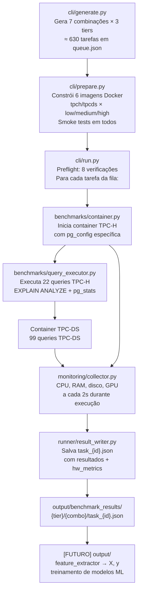

# TCC — Auto-Tuning PostgreSQL

Bem-vindo à documentação do projeto de Trabalho de Conclusão de Curso sobre **ajuste automático de configurações PostgreSQL** em ambientes Docker usando benchmarks analíticos TPC-H e TPC-DS.

## Objetivo do Projeto

O objetivo central é realizar um **estudo de ablação experimental** para medir como diferentes grupos de parâmetros PostgreSQL afetam a performance de workloads analíticos. O projeto gera sistematicamente centenas de configurações via **Latin Hypercube Sampling (LHS)**, executa benchmarks TPC-H (22 queries) e TPC-DS (99 queries) em containers Docker isolados, coleta métricas de hardware em tempo real, e persiste os resultados em JSON estruturado para posterior análise por modelos de aprendizado de máquina.

## Estrutura do Projeto

```
Autotuning-PostgreSQL/
├── pg_sampler/              ← Gerador de configs PostgreSQL via LHS
├── benchmarks/              ← Execução de benchmarks TPC-H e TPC-DS
│   ├── container.py         ← Gerenciamento de containers Docker
│   ├── image_builder.py     ← Build das imagens Docker com dados TPC
│   ├── query_executor.py    ← Execução de queries e coleta de stats
│   ├── tpc_h/               ← Wrapper TPC-H (22 queries, DB=tpch)
│   └── tpc_ds/              ← Wrapper TPC-DS (99 queries, DB=tpcds)
├── runner/                  ← Orquestração da execução
│   ├── preflight.py         ← 8 verificações pré-execução
│   ├── task_executor.py     ← Execução individual de tarefas
│   └── result_writer.py     ← Persistência de resultados em disco
├── task_queue/              ← Fila de execução persistente
│   └── execution_queue.py   ← ExecutionQueue com estados e retentativas
├── monitoring/              ← Coleta de métricas de hardware
│   └── collector.py         ← CPU, RAM, disco, GPU, RAPL
├── utils/                   ← Utilitários transversais
│   ├── logging.py           ← TeeWriter, log(), banner(), sep()
│   ├── formatting.py        ← fmt_duration(), fmt_eta()
│   └── docker_cleanup.py    ← Limpeza automática de disco Docker
├── cli/                     ← Pontos de entrada CLI
│   ├── generate.py          ← Gera fila de tarefas (queue.json)
│   ├── prepare.py           ← Constrói 6 imagens Docker + smoke tests
│   └── run.py               ← Executa tarefas da fila
├── web/                     ← Interface web (FastAPI + SSE)
│   ├── app.py               ← Backend FastAPI com endpoints REST e SSE
│   └── index.html           ← Frontend HTML/JS
├── specs/                   ← Especificações de ambientes e parâmetros
│   ├── docker.json          ← Recursos por tier (cpu, ram, shm)
│   └── spaces/              ← Espaços de busca por stage e tier
│       ├── stage1/{low,medium,high}.json
│       ├── stage2/{low,medium,high}.json
│       └── stage3/{low,medium,high}.json
└── output/                  ← Saída gerada em tempo de execução
    ├── queue.json            ← Fila persistente de tarefas
    ├── generate.log          ← Log do gerador
    ├── runner.log            ← Log do runner
    └── benchmark_results/   ← Resultados por tier/combinação/tarefa
        └── {tier}/{combo}/task_{id}.json
```

## Fluxo de Execução



## Tiers de Hardware

| Tier | vCPUs | RAM | Scale Factor | shm_size |
|------|-------|-----|--------------|---------|
| **low** | 2 | 2 GB | SF=1 | 576 MB |
| **medium** | 4 | 4 GB | SF=2 | 1.152 MB |
| **high** | 6 | 6 GB | SF=4 | 1.536 MB |

## Combinações de Estágios

O projeto gera **7 combinações** de estágios de parâmetros para estudo de ablação:

| Rótulo | Stages | Parâmetros | Tarefas (padrão 30 configs) |
|--------|--------|------------|------------------------------|
| `s1` | [1] | 12 | 30 × 3 tiers = 90 |
| `s2` | [2] | 12 | 90 |
| `s3` | [3] | 12 | 90 |
| `s1s2` | [1,2] | 24 | 90 |
| `s1s3` | [1,3] | 24 | 90 |
| `s2s3` | [2,3] | 24 | 90 |
| `s1s2s3` | [1,2,3] | 36 | 90 |
| **Total** | | | **630 tarefas** |

## Status dos Componentes

| Componente | Descrição | Status |
|---|---|---|
| **pg_sampler/** | Gerador de configs via LHS | Completo |
| **benchmarks/** | Execução TPC-H/TPC-DS em Docker | Completo |
| **runner/** | Orquestração, preflight, result writer | Completo |
| **task_queue/** | Fila persistente com retentativas | Completo |
| **monitoring/** | Coleta de CPU/RAM/GPU/RAPL | Completo |
| **web/** | Interface de controle FastAPI+SSE | Completo |
| **output/ (ML)** | feature_extractor, modelos ML | Em desenvolvimento |

## Como Navegar

- [**Arquitetura**](arquitetura.md) — Como todos os módulos se conectam
- [**Executando o Projeto**](execucao.md) — Passo a passo completo
- [**Benchmarks**](benchmarks/index.md) — TPC-H, TPC-DS, containers e imagens
- [**Geração de Configurações**](geracao/index.md) — LHS, estágios, espaços de parâmetros
- [**Fila de Execução**](fila/index.md) — ExecutionQueue, estados e retentativas
- [**Monitoramento**](monitoramento.md) — MetricsCollector, hardware metrics
- [**Formato dos Resultados**](resultado.md) — Estrutura completa do JSON de resultados
- [**Pipeline ML**](ml_pipeline_reference.md) — Referência para o módulo de ML
- [**API Reference**](api/pg_sampler.md) — Documentação de cada módulo
